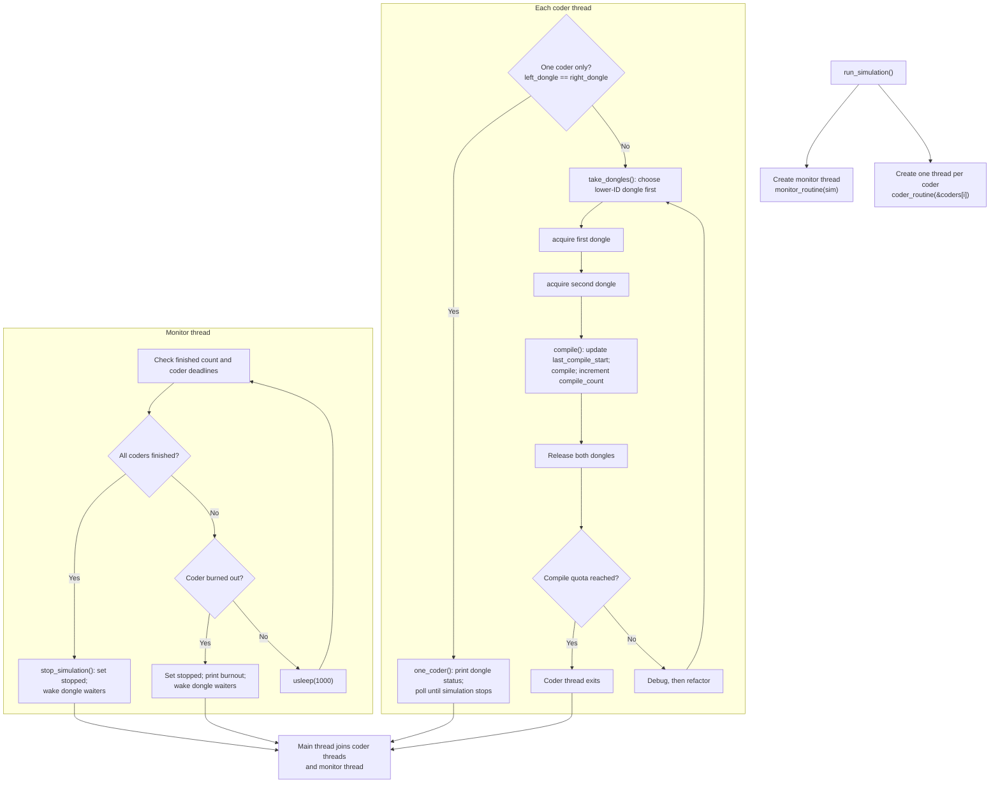
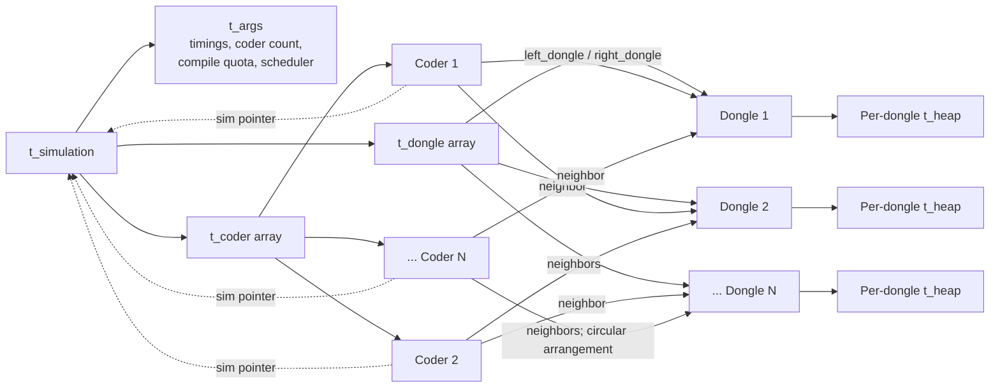
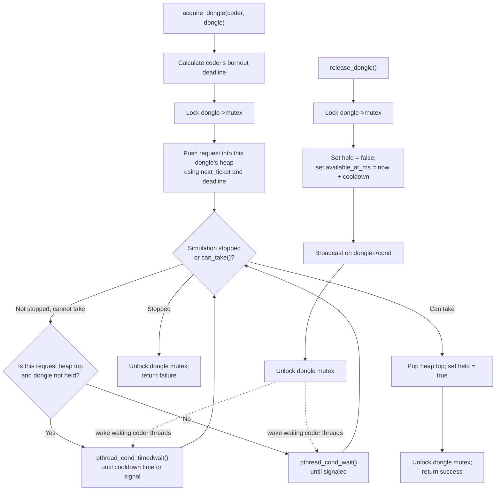

### THREADS:

```mermaid
flowchart TD
    START["run_simulation()"] --> MON["Create monitor thread<br/>monitor_routine(sim)"]
    START --> CREATE["Create one thread per coder<br/>coder_routine(&coders[i])"]

    subgraph CODER["Each coder thread"]
        C0{"One coder only?<br/>left_dongle == right_dongle"}
        C0 -- Yes --> ONE["one_coder(): print dongle status;<br/>poll until simulation stops"]
        C0 -- No --> TAKE["take_dongles(): choose lower-ID dongle first"]
        TAKE --> ACQ1["acquire first dongle"]
        ACQ1 --> ACQ2["acquire second dongle"]
        ACQ2 --> COMPILE["compile(): update last_compile_start;<br/>compile; increment compile_count"]
        COMPILE --> RELEASE["Release both dongles"]
        RELEASE --> DONE{"Compile quota reached?"}
        DONE -- Yes --> EXIT["Coder thread exits"]
        DONE -- No --> DEBUG["Debug, then refactor"]
        DEBUG --> TAKE
    end

    subgraph MONITOR["Monitor thread"]
        CHECK["Check finished count and coder deadlines"] --> ALL{"All coders finished?"}
        ALL -- Yes --> STOP["stop_simulation(): set stopped;<br/>wake dongle waiters"]
        ALL -- No --> BURN{"Coder burned out?"}
        BURN -- Yes --> BSTOP["Set stopped; print burnout;<br/>wake dongle waiters"]
        BURN -- No --> SLEEP["usleep(1000)"] --> CHECK
    end

    EXIT --> JOIN["Main thread joins coder threads<br/>and monitor thread"]
    ONE --> JOIN
    STOP --> JOIN
    BSTOP --> JOIN
```
### STRUCTURES:

```mermaid
flowchart LR
    SIM["t_simulation"]
    ARGS["t_args<br/>timings, coder count,<br/>compile quota, scheduler"]
    CODERS["t_coder array"]
    DONGLES["t_dongle array"]

    SIM --> ARGS
    SIM --> CODERS
    SIM --> DONGLES

    CODERS --> C1["Coder 1"]
    CODERS --> C2["Coder 2"]
    CODERS --> CN["... Coder N"]

    DONGLES --> D1["Dongle 1"]
    DONGLES --> D2["Dongle 2"]
    DONGLES --> DN["... Dongle N"]

    C1 -->|"left_dongle / right_dongle"| D1
    C1 -->|"neighbor"| D2
    C2 -->|"neighbors"| D2
    C2 -->|"neighbor"| DN
    CN -->|"neighbors; circular arrangement"| DN
    CN -->|"neighbor"| D1

    C1 -. "sim pointer" .-> SIM
    C2 -. "sim pointer" .-> SIM
    CN -. "sim pointer" .-> SIM

    D1 --> H1["Per-dongle t_heap"]
    D2 --> H2["Per-dongle t_heap"]
    DN --> HN["Per-dongle t_heap"]
```
### DONGLE ACQUISITION AND LOCKS:

```mermaid
flowchart TD
    A["acquire_dongle(coder, dongle)"] --> B["Calculate coder's burnout deadline"]
    B --> C["Lock dongle->mutex"]
    C --> D["Push request into this dongle's heap<br/>using next_ticket and deadline"]
    D --> E{"Simulation stopped<br/>or can_take()?"}

    E -- "Not stopped; cannot take" --> F{"Is this request heap top<br/>and dongle not held?"}
    F -- Yes --> G["pthread_cond_timedwait()<br/>until cooldown time or signal"]
    F -- No --> H["pthread_cond_wait()<br/>until signaled"]
    G --> E
    H --> E

    E -- "Stopped" --> I["Unlock dongle mutex;<br/>return failure"]
    E -- "Can take" --> J["Pop heap top; set held = true"]
    J --> K["Unlock dongle mutex;<br/>return success"]

    L["release_dongle()"] --> M["Lock dongle->mutex"]
    M --> N["Set held = false;<br/>set available_at_ms = now + cooldown"]
    N --> O["Broadcast on dongle->cond"]
    O --> P["Unlock dongle mutex"]
    P -. "wake waiting coder threads" .-> G
    P -. "wake waiting coder threads" .-> H
```
